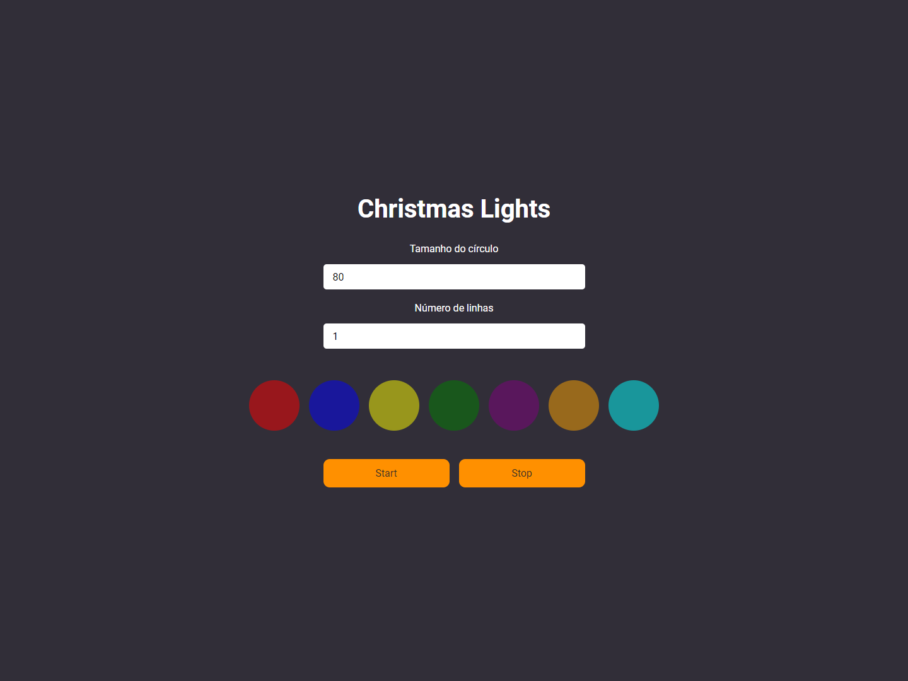
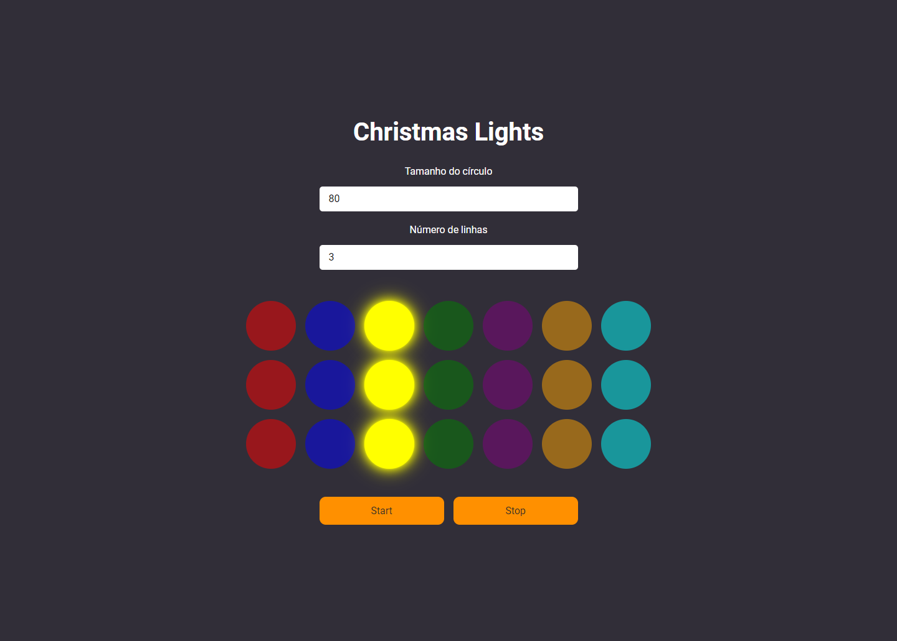

<h1 align="center">
 
Christmas Lights
</h1>

This project was created to explore css box-shadow and custom react hooks.

  

  
  

## Features

- User can press a button to start and stop the display
- User can change the size of circles in the row
- User can specify the number of rows to be included in the display

- ⚛️ **React Js** — A JavaScript library for building user interfaces

## Getting started

- Clone project > enter the project folder
- run `yarn`
- run `yarn start`

## License

This project is licensed under the MIT License - see the [LICENSE](https://opensource.org/licenses/MIT) page for details.

---

Created with passion by me 👨🏻‍💻
